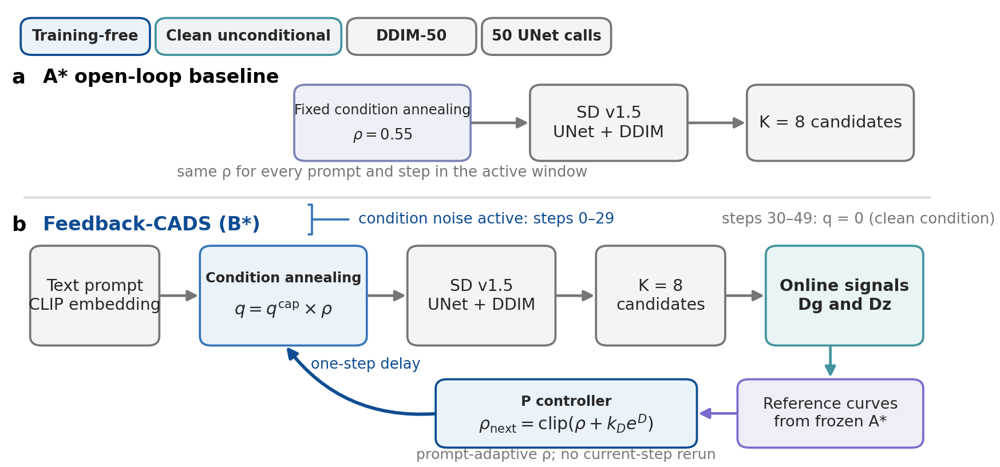
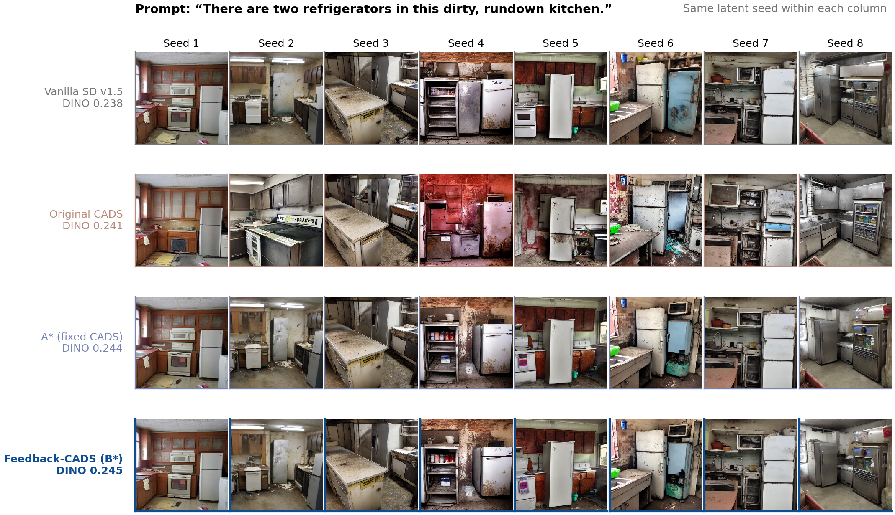
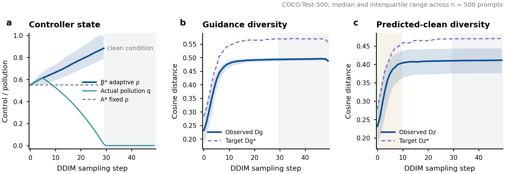
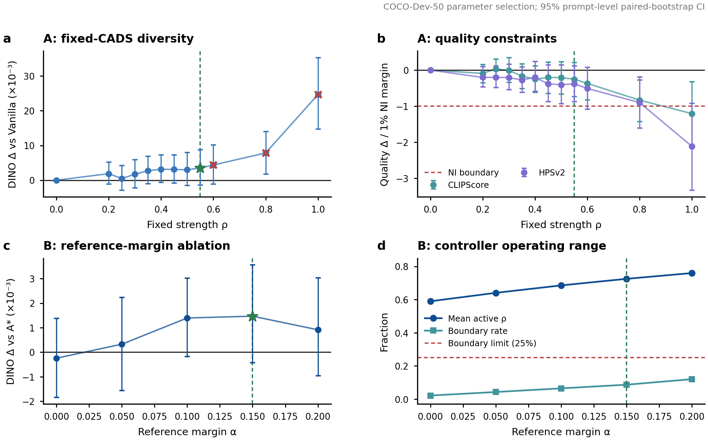

# Feedback-CADS

Feedback-CADS is a training-free, closed-loop condition-annealing method for
Stable Diffusion v1.5. It observes within-prompt candidate diversity during
DDIM sampling and adapts the next-step condition-noise strength without model
training or additional UNet passes relative to the matched open-loop baseline.

This repository is the reproducibility and evidence package for the frozen
Feedback-CADS study. Its public CLI replays the preregistered experiments and
audits; it is not currently distributed as a general-purpose inference package.
Feedback-CADS builds on the original [Condition-Annealed Diffusion Sampler
(CADS)](https://openreview.net/forum?id=zMoNrajk2X).

## Main result

The preregistered comparison uses 500 held-out MS-COCO captions, eight images
per prompt, paired latent/condition seeds, and 10,000 prompt-level bootstrap
replicates.

| Method | DINO diversity ↑ | CLIPScore ↑ | HPSv2 ↑ | Time (s/group) ↓ | Batched UNet passes ↓ |
|---|---:|---:|---:|---:|---:|
| Vanilla SD v1.5 | 0.200100 | **0.785446** | **0.260481** | **7.1916** | 50 |
| Original CADS | **0.235120** | 0.778002 | 0.246984 | 7.2249 | 50 |
| A*: fixed clean-unconditional CADS | 0.203794 | 0.782338 | 0.258324 | 7.2304 | 50 |
| **Feedback-CADS (B*)** | 0.204895† | 0.781730 | 0.257690 | 7.2686 | 50 |

Values are prompt-group means; each group contains eight candidate images.
DINO diversity is the mean pairwise cosine distance between DINOv2 image
features. CLIPScore is `2.5 * max(CLIP cosine alignment, 0)`, and HPSv2 denotes
HPSv2.1. The 50 UNet passes are batched over all eight candidates and should not
be interpreted as the cost of single-image sampling. Runtime was measured on an
RTX 4090 and is hardware-dependent. † B* exceeds A* with a positive 95% paired
bootstrap confidence interval; bold numeric values denote the best method mean
in each column.

For the primary paired comparison B* − A*, DINO diversity improves by
`+0.001101` with 95% CI `[0.000289, 0.001926]`. CLIPScore and HPSv2 are
slightly lower but both pass the preregistered 1% non-inferiority criterion.
The supported claim is therefore a statistically significant diversity gain
over the matched open-loop A* baseline while preserving preregistered quality
non-inferiority. B* must not be described as quality-non-inferior to Vanilla on
every metric because the exploratory HPSv2 comparison against Vanilla fails
that criterion. B* adds no UNet passes relative to A*; its measured runtime is
`+0.0382` seconds per eight-image prompt group (`+0.53%`) on the reported
hardware.

Exact tables, per-prompt measurements, bootstrap records, parameter selections,
reference curves, figure source data, and publication figures are under
[`results/`](results/). The 7 GB generated-image archive and third-party
model weights are intentionally not stored in Git.

## Controller at a glance

For prompt group `p` and sampling step `i`, Feedback-CADS uses

```text
q[p,i]       = q_cap[i] * rho[p,i]
g_target[i]  = (1 + alpha) * g_ref[i]
z_target[i]  = (1 + alpha) * z_ref[i]
e_g[p,i]     = (g_target[i] - g[p,i]) / (g_target[i] + epsilon)
e_z[p,i]     = (z_target[i] - z[p,i]) / (z_target[i] + epsilon)
e_D[p,i]     = e_g[p,i] before latent control is eligible,
               max(e_g[p,i], e_z[p,i]) afterwards
rho[p,i+1]   = clip(rho[p,i] + k_D * e_D[p,i], 0, 1)
```

Here `q_cap` is the fixed condition-pollution schedule, `g` is guidance
diversity, and `z` is predicted-clean-latent diversity. The frozen B* settings
are `rho[p,0] = 0.55`, `alpha = 0.15`, `k_D = 0.08`, and
`epsilon = 1e-6`. Latent control becomes eligible at normalized loop progress
`0.20`. The update has a one-step delay; condition noise is active only for
DDIM steps 0–29 and is exactly zero for steps 30–49. The implementation is in
[`controller.py`](src/feedback_cads/controller.py) and
[`pipeline.py`](src/feedback_cads/pipeline.py).

The frozen protocol, stage-by-stage commands, confirmation gates, and expected
artifacts are documented in [`REPRODUCE.md`](REPRODUCE.md).

## Visual overview

### Fig. 1 | Feedback-CADS method

[](results/publication/project_figures/fig1_feedback_cads_method.pdf)

The matched A* baseline uses fixed condition annealing with `rho = 0.55`.
Feedback-CADS instead measures candidate diversity from the existing SD v1.5
forward pass, compares it with frozen A* reference curves, and applies a
one-step-delayed proportional update to the next condition-noise strength.
Both methods retain DDIM-50 and exactly 50 batched UNet passes per eight-image
prompt group.

### Fig. 2 | Same-prompt, same-seed comparison

[](results/publication/project_figures/fig2_qualitative_same_seed.pdf)

Rows compare the four methods and columns share the same initial latent seed.
This automatically selected, quality-eligible example illustrates the
within-prompt variation produced by each method. It is a qualitative example;
the formal conclusion is based on all 500 held-out prompts rather than this
single image plate.

### Fig. 3 | Closed-loop controller dynamics

[](results/publication/project_figures/fig3_controller_dynamics.pdf)

Across COCO-Test-500, the controller adapts `rho` by prompt while tracking the
frozen guidance- and latent-diversity reference curves. Condition pollution is
hard-disabled after step 29. The plotted numerical values are available as
[`fig3_controller_dynamics_source_data.csv`](results/publication/project_figures/fig3_controller_dynamics_source_data.csv).

### Fig. 4 | Parameter selection and ablation

[](results/publication/project_figures/fig4_dev_ablation.pdf)

COCO-Dev-50 selects `rho* = 0.55` for A* and reference margin `alpha* = 0.15`
for B*. Crosses identify settings that fail at least one preregistered quality
non-inferiority constraint. These development-set panels document parameter
selection and are not formal test-set evidence. Source data are provided in
[`fig4_ablation_source_data.csv`](results/publication/project_figures/fig4_ablation_source_data.csv).

Complete publication legends and figure QA notes are available under
[`results/publication/project_figures/`](results/publication/project_figures/).

## Result package map

- [`results/formal_test500/`](results/formal_test500/) contains the formal
  summaries, all 2,000 method-prompt measurements, paired comparisons, and
  independent audit records.
- [`results/development/`](results/development/) contains the frozen A* and B*
  selections, reference curves, per-step signals, and development-set
  ablations.
- [`results/publication/`](results/publication/) contains publication tables,
  figures, legends, QA notes, and numerical source data.

Run `sha256sum -c results/CHECKSUMS.sha256` from the repository root to verify
the Git-friendly result package. Formal PNGs, per-image feature caches, and TIFF
exports remain in the omitted local `outputs/` archive.

## Repository layout

```text
configs/                 Frozen experiment and evaluation protocols
data/                    Frozen prompt manifests
results/                 Git-friendly numerical results and figures
scripts/feedback_cads_cli.py
scripts/_steps/          Auditable generation/evaluation/reporting stages
src/feedback_cads/       Method implementation
tests/                   Unit, artifact-regression and GPU integration tests
```

`models/` and `outputs/` are local runtime directories and are ignored by Git.

## Quick verification

The shortest GPU-free check does not require model weights or the generated
image archive:

```bash
git clone https://github.com/huhu3126137582-design/feedback-cads.git
cd feedback-cads
python -m venv .venv
source .venv/bin/activate
python -m pip install --upgrade pip
python -m pip install -r requirements.txt
python -m pytest -q -m "not artifact and not gpu"
sha256sum -c results/CHECKSUMS.sha256
```

This verifies the method logic and delivered numerical evidence. Generating or
reevaluating images requires CUDA and the pinned model snapshots described
below.

## Environment

The reproduced environment used Python 3.10.8, PyTorch 2.4.1 with CUDA 12.1,
and an NVIDIA RTX 4090. Create it with either:

```bash
conda env create -f environment.yml
conda activate feedback-cads
```

or:

```bash
python -m venv .venv
source .venv/bin/activate
python -m pip install --upgrade pip
python -m pip install -r requirements.txt
```

The `hpsv2` Python package is not required; HPSv2.1 is evaluated with the
pinned OpenCLIP implementation and frozen checkpoint.

## Model preparation

Install the Hugging Face CLI from `requirements.txt`, then populate the local
cache from the project root:

```bash
mkdir -p models/huggingface/hub

hf download stable-diffusion-v1-5/stable-diffusion-v1-5 \
  --revision 451f4fe16113bff5a5d2269ed5ad43b0592e9a14 \
  --cache-dir models/huggingface/hub

hf download facebook/dinov2-base \
  --revision f9e44c814b77203eaa57a6bdbbd535f21ede1415 \
  --cache-dir models/huggingface/hub

hf download sentence-transformers/clip-ViT-B-32 \
  --revision 327ab6726d33c0e22f920c83f2ff9e4bd38ca37f \
  --cache-dir models/huggingface/hub

hf download xswu/HPSv2 \
  --revision 697403c78157020a1ae59d23f111aa58ced35b0a \
  --cache-dir models/huggingface/hub
```

See [`THIRD_PARTY.md`](THIRD_PARTY.md) before redistributing models or data.

## Data

The hash-frozen `COCO-Dev-50` and `COCO-Test-500` caption manifests are already
included under `data/coco/`; raw COCO images are not required. The absolute
paths in `coco_caption_splits.json` are historical provenance strings protected
by the formal protocol hash, not runtime path requirements.

To rebuild the split, place `captions_val2017.json` under
`data/coco/annotations/` and run:

```bash
python scripts/feedback_cads_cli.py data build-coco-splits
```

Rebuilding creates a new provenance metadata file. Use the repository-provided
frozen metadata when reproducing the published formal protocol hash.

## Tests and verification

The GitHub-sized checkout supports unit and delivery-result tests without the
large model/output archives:

```bash
python -m pytest -q -m "not artifact and not gpu"
```

This lightweight tier is the expected check for a GitHub-sized checkout.

With local models and the full `outputs/` archive restored, run all tests:

```bash
python -m pytest -q
```

Run the complete frozen replay, including all 16,000 PNG hashes, formal metric
aggregation, report audit and tests:

```bash
python scripts/feedback_cads_cli.py verify
```

The final local delivery audit passed all 77 tests, reproduced all 10,000
bootstrap replicates, and verified the SHA-256 digest and 512 x 512 resolution
of all 16,000 formal PNG files.

Archived manifests retain their original absolute paths for byte-level hash
identity. Readers transparently rebase missing `outputs/`, `data/`, `configs/`,
`models/` or `results/` paths onto the current checkout.

## Reproduction workflow

Stage-by-stage commands and confirmation gates are listed in
[`REPRODUCE.md`](REPRODUCE.md). Full generation requires approximately 7 GB for
formal PNG outputs in addition to model caches and development runs.

## Citation and prior work

Feedback-CADS builds on the Condition-Annealed Diffusion Sampler introduced by
Sadat et al. at ICLR 2024:

```bibtex
@inproceedings{sadat2024cads,
  title     = {CADS: Unleashing the Diversity of Diffusion Models through
               Condition-Annealed Sampling},
  author    = {Sadat, Seyedmorteza and Buhmann, Jakob and Bradley, Derek and
               Hilliges, Otmar and Weber, Romann M.},
  booktitle = {International Conference on Learning Representations},
  year      = {2024},
  url       = {https://openreview.net/forum?id=zMoNrajk2X}
}
```

A project-specific Feedback-CADS citation should be added here when its
corresponding paper or archival technical report is released.

## License

No project-level software license is currently included, so the repository
contents should not be assumed to grant reuse or redistribution rights. Add an
explicit `LICENSE` before inviting downstream software reuse. Model checkpoints
and data remain governed by their upstream terms; see
[`THIRD_PARTY.md`](THIRD_PARTY.md).
